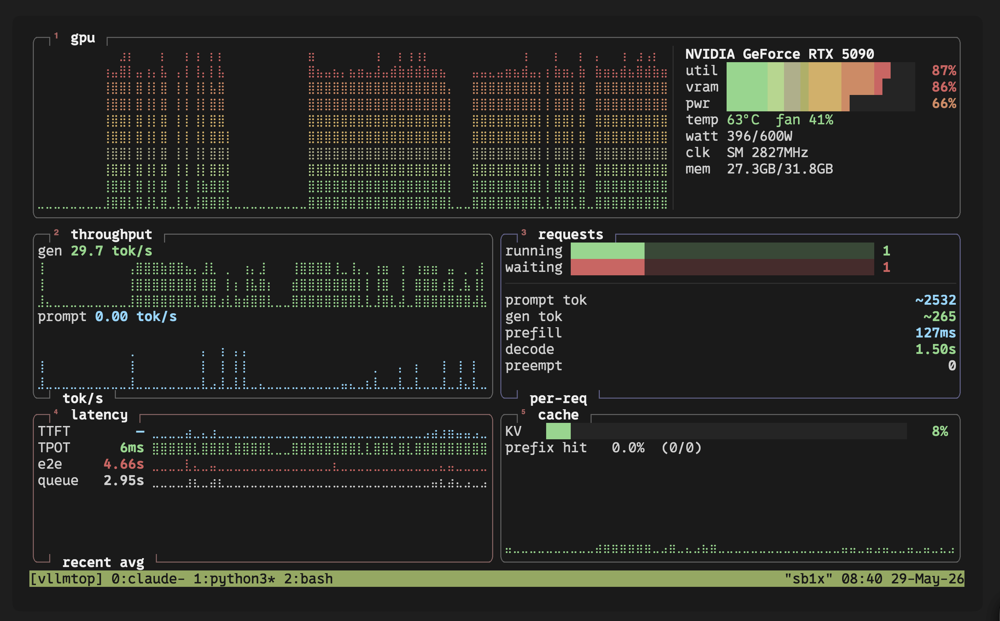

# vllmtop/vllmpytop

[](https://pypi.org/project/vllmpytop/)
[](https://pypi.org/project/vllmpytop/)
[](https://github.com/theo-kirby/vllmtop/blob/main/LICENSE)

Inspired by the excellent TUI style and functionality of [btop](https://github.com/aristocratos/btop),
vllmtop is a CLI resource monitor for a [vLLM](https://github.com/vllm-project/vllm)
instance and its GPU in real time. Simple braille charts, a responsive
curses layout, and a non-blocking background poller so the UI never stalls on
network or NVML latency.



## Quickstart

```bash
pip install vllmpytop    # install from pypi
vllmtop                  # or vllmpytop

```


## What it shows

- **GPU**: utilisation %, VRAM used/total, temperature, power draw vs. limit,
  SM clock, fan speed — with green/yellow/red thresholds. Its chart is a
  btop-style **mirrored graph**: GPU utilisation grows up from a centre line
  (positionally coloured green→red), and the request count grows down from it
  as a stacked two-band series — running (green) nearest the centre, waiting
  (magenta) beyond. The right side of the panel carries a compact **vLLM**
  column separated by a divider: the served model (● awake / ○ sleeping),
  uptime, KV-cache precision (`cache_dtype`), total requests served,
  prefix-caching on/off, KV blocks, GPU-memory target, and run/wait/kv bars.
- **Throughput**: generation tok/s and prompt tok/s (rates derived from vLLM
  counters), as a mirrored chart in btop's network colours — gen (purple) grows
  up from the centre line, prompt/prefill (pink) grows down — each half fading
  dark at the baseline to bright at the peak. A stats column on the right shows
  current and peak values for both.
- **Requests**: a live feed of inference calls, newest first (like btop's
  process list). When a log source is configured (`--docker <container>` or
  `--log-file <path>`) and vLLM runs with `--enable-log-requests`, each row
  shows the request age, prompt text (truncated), request ID, and max_tokens.
  Without `--enable-log-requests` the feed still shows entries but without
  prompt text. With no log source, a hint reminds you to enable one.
- **Perf** (recent average over the last poll interval — far more useful live
  than the cumulative average): TTFT, inter-token (TPOT), end-to-end, and queue
  latencies as colour-coded braille sparklines, each with a right-aligned value
  column. Below a `┄ per-request ┄` divider: per-request prompt tokens,
  generation tokens, prefill time, and decode time. Fills remaining space with
  the KV-cache usage gradient chart and prefix-cache hit rate.

Data comes from vLLM's Prometheus `/metrics` endpoint plus in-process NVML
polling. If vLLM goes away (e.g. a container restart) the UI shows a disconnect
banner and keeps the GPU panel live, then reconnects automatically.

## Install

Available on PyPI: **[pypi.org/project/vllmpytop](https://pypi.org/project/vllmpytop/)**.

Requires Python 3.10+ on Linux (curses is stdlib). A working NVIDIA driver is
needed for the GPU panel.

### install from pypi

```bash
pip install vllmpytop
```

### install locally
```bash
# locally from a checkout:
pip install .

# / for development:
pip install -e ".[dev]"
```

This installs two equivalent commands — `vllmpytop` and the shorter alias `vllmtop`.

Dependencies: `nvidia-ml-py` (NVML bindings) and `prometheus-client` (exposition
parser). The `/metrics` fetch uses stdlib `urllib`.

## Usage

```bash
vllmtop                            # monitor http://localhost:8000
vllmtop --url http://host:8000     # a remote vLLM server
vllmtop --interval 0.5             # poll twice a second
vllmtop --no-gpu                   # skip the GPU panel
vllmtop --docker vllm-server       # + call feed in the requests panel (docker logs)
vllmtop --log-file /var/log/vllm.log   # + call feed from a log file
python -m vllmpytop                # same thing, without the entry point
```

The server URL can also be set via the `VLLMTOP_URL` environment variable.
The log file path and Docker container can be set via `VLLMTOP_LOG_FILE` and
`VLLMTOP_DOCKER` respectively.

### Options

| Flag | Default | Description |
|------|---------|-------------|
| `--url` | `http://localhost:8000` | vLLM base URL (env `VLLMTOP_URL`) |
| `--interval` | `1.0` | poll interval in seconds (0.2–10.0, also toggled with `+` / `-`) |
| `--gpu-index` | `0` | NVML GPU index |
| `--no-gpu` | off | disable the GPU panel |
| `--docker` | — | stream `docker logs -f <container>` for the requests call feed (env `VLLMTOP_DOCKER`) |
| `--log-file` | — | tail this vLLM log file for the requests call feed (env `VLLMTOP_LOG_FILE`) |
| `--dump-json` | off | collect two snapshots, print derived metrics as JSON, exit (no TTY) |

### Keybindings

| Key | Action |
|-----|--------|
| `q` / `Esc` | quit |
| `+` / `-` | faster / slower refresh |
| `p` | pause / resume polling |
| `1`–`4` | toggle a panel on/off (¹gpu ²throughput ³requests ⁴perf) |
| `h` / `?` | toggle help overlay |

Each panel's title carries a superscript number (btop-style) showing the key
that toggles it. Hiding panels reflows the rest to fill the freed space.

### Headless smoke test

`--dump-json` collects two snapshots an interval apart (so rates are populated),
prints the result as JSON, and exits. Works without a TTY — handy for CI or
verifying connectivity:

```bash
python -m vllmpytop --dump-json --url http://localhost:8000
```

## How it works

- A **background poller thread** scrapes `/metrics` and polls NVML every
  `interval` seconds, storing the latest combined snapshot under a lock. This
  keeps all I/O latency off the render path.
- The **UI loop** wakes on a short tick (250 ms), reads the latest snapshot,
  appends derived values (rates, recent-average latencies) to per-series ring
  buffers, and redraws — so render cadence is independent of poll cadence.
- **Counters → rates**: `Δvalue / Δt`, guarded against `Δt ≤ 0` and counter
  resets. **Histograms → recent average**: `Δsum / Δcount` between polls.
- **Braille charts**: each cell is a 2×4 Unicode braille dot matrix, giving
  `2w × 4h`-dot resolution for the smooth btop look.

## Development

```bash
pytest        # parser-against-fixture, rate math, braille rendering
```

## License

MIT — see [LICENSE](LICENSE).
